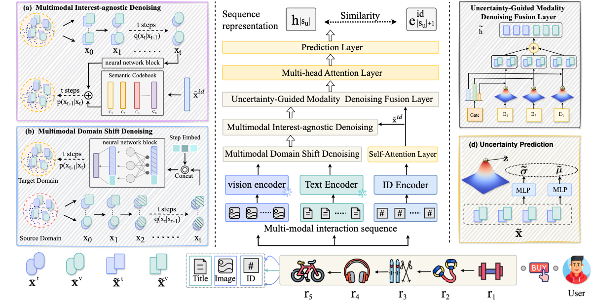

# DMMD4SR: Diffusion Model-based Multi-level Multimodal Denoising for Sequential Recommendation

This repository contains the code for our **anonymous** submission to **ACMMM 2025**.

## Model Architecture

The overall framework of our proposed DMMD4SR model is illustrated below:



## Environment Setup

The code requires the following main dependencies:

*   Python == 3.9
*   PyTorch == 2.1.1

*Note: Other required packages are common libraries and can be installed using pip as needed.*

## Datasets

We evaluate our model on the following 5-core subsets of the Amazon Review Data:

*   Home & Kitchen (`Home`)
*   Beauty
*   Tools & Home Improvement (`Tools`)
*   Toys & Games (`Toys`)

The datasets can be found at: [UCSD Amazon Review Data](https://jmcauley.ucsd.edu/data/amazon/)


## How to Run

To run the experiment on the Beauty dataset, execute the following script:

```bash
bash run_beauty.sh
```

*(You may need to adapt the script or create similar ones for other datasets.)*

## Code Framework Acknowledgement

Our implementation is based on the codebase of [STOSA](https://github.com/zfan20/STOSA?tab=readme-ov-file). We thank the authors for releasing their code.
```

